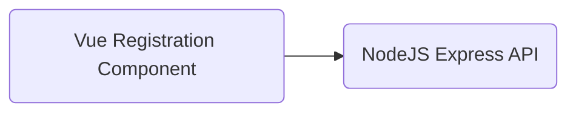

# Página de login

Esta aplicação foi desenvolvida com uso do Design System [Sanhauá](https://github.com/fpcoutinho/sanhaua).

Web app simples que simula uma tela de cadastro de usuários com 4 passos.<br>
O client foi desenvolvido utilizando vue.js 3, o servidor com nodejs e express, e a aplicação é renderizada no servidor utilizando os métodos nativos de SSR do Vite.<br>



## Requisitos

|         | Versão    |
| ------- | --------- |
| _Node_  | `20.9.0` |
| _NPM\*_ | `10.9.0`   |

## Set up da aplicação

Instalar todas as dependências

```console
npm install
```

---

Rodar a aplicação no modo de desenvolvimento

```console
npm run server
```

---

## Layout

O layout completo da aplicação, com todos os passos.

## Endpoints

`[GET] /registration`

- Responsável por renderizar um html simples que irá carregar os componentes do formulário.

`[POST] /registration`

- Responsável por receber os dados submetidos pelo usuário em formato JSON.
